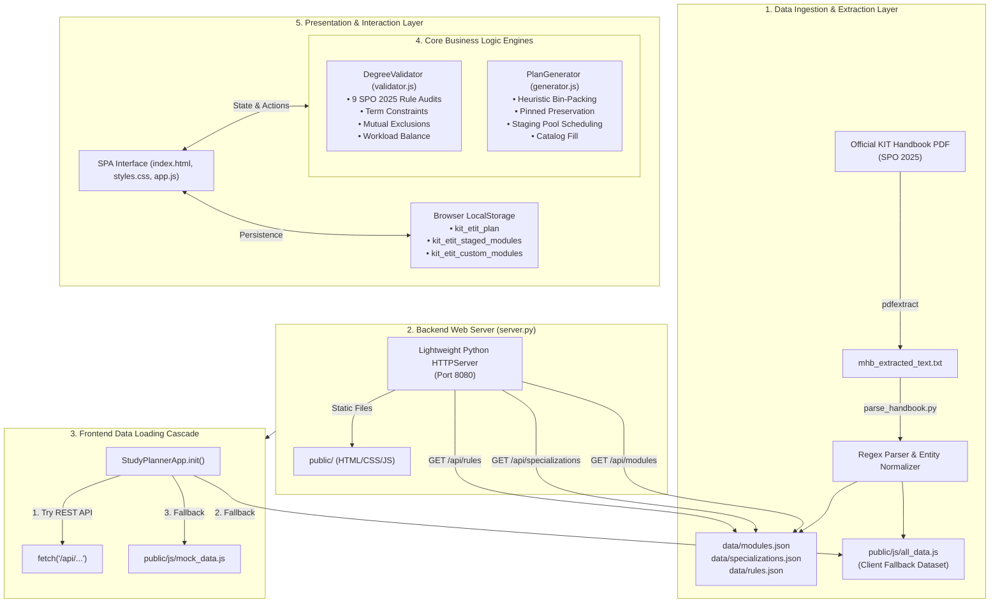

# Developer Documentation & Architecture Guide
## KIT M.Sc. ETIT Study Planner & Modulhandbuch Tool (SPO 2025)

This document provides a comprehensive reference for future developers, maintainers, and contributors working on the **KIT M.Sc. Electrical Engineering and Information Technology (ETIT) Degree Planner and Module Handbook Tool**. It covers the system architecture, data models, ingestion pipeline, degree audit algorithms, frontend state management, and maintenance workflows.

---

## 1. System Overview & Philosophy

The tool is an interactive web-based degree planning, conflict analysis, and study audit application designed specifically for the Master of Science in Electrical Engineering and Information Technology (M.Sc. ETIT) at the **Karlsruhe Institute of Technology (KIT)** under the **2025 Study and Examination Regulations (SPO 2025)**.

### Core Architectural Principles
1. **Zero External Dependencies**: The backend requires only the Python 3 standard library (`http.server`, `json`, `re`, `urllib`). No `pip install`, no node/npm build step, and no external package managers are needed to run or deploy the system.
2. **Dual-Mode Execution (Server & Standalone Offline)**: The frontend can run either via the local Python HTTP server (`server.py`) using REST APIs or completely standalone via `file:///` in a web browser using embedded precompiled datasets (`public/js/all_data.js`).
3. **Instant Interactive Verification**: Rule checking and constraint auditing run instantaneously on the client side upon every user drag, drop, pin, or configuration toggle, giving immediate feedback without round-trip server latency.
4. **Resilient Data Ingestion**: A dedicated parser translates raw extracted text from the official KIT Module Handbook PDF into validated JSON structures, decoupling PDF layout changes from the application runtime.

---

## 2. High-Level Architecture

The system consists of five distinct layers:



---

## 3. Directory & File Structure

```
Modulhandbuch-tool/
├── MHB_MSc25_ETIT_SS26-88-848-H-2025_v1_2026-03-06_en.pdf  # Official KIT Module Handbook PDF
├── pdfextract                                               # Compiled arm64 binary for PDF text extraction
├── mhb_extracted_text.txt                                   # Raw text dump extracted from handbook PDF
├── server.py                                                # Zero-dependency Python HTTP & REST API server
├── DOCUMENTATION.md                                         # Comprehensive developer & architecture guide
├── README.md                                                # Quickstart guide & repository summary
├── data/                                                    # Extracted canonical JSON datasets
│   ├── modules.json                                         # 247 catalog modules with full metadata
│   ├── specializations.json                                 # 4 Fields of Specialisation & course buckets
│   └── rules.json                                           # SPO 2025 degree rules & known exclusions
├── scripts/                                                 # Data processing & verification scripts
│   ├── parse_handbook.py                                    # Regex parsing pipeline from raw text to JSON/JS
│   └── validate_plan.py                                     # Headless CLI verification tool for study plans
└── public/                                                  # Static web assets served to the browser
    ├── index.html                                           # Main application UI layout & modal templates
    ├── css/
    │   └── styles.css                                       # KIT design system tokens & component styles
    └── js/
        ├── all_data.js                                      # Precompiled full dataset for standalone browser mode
        ├── mock_data.js                                     # Curated fallback dataset with exemplary plan
        ├── validator.js                                     # JavaScript implementation of SPO 2025 degree rules
        ├── generator.js                                     # Constraint satisfaction auto-planning algorithm
        └── app.js                                           # UI controller, drag & drop, modals, state storage
```

---

## 4. Data Models & Schemas

The application revolves around four primary entities: `Module`, `Specialization`, `Rules`, and `StudyPlan`.

### 4.1 Module Schema (`data/modules.json`)

Each module represents an academic unit accredited by the KIT Department of Electrical Engineering and Information Technology (or associated partner faculties such as Informatics, Mechanical Engineering, or Mathematics).

```typescript
interface Module {
  id: string;                        // Unique identifier, e.g., "M-ETIT-103802"
  title: string;                     // Course title, e.g., "Adaptive Optics"
  credits: number;                   // Credit points in ECTS (typically 2 to 30)
  term: "WS" | "SS" | "WS+SS";       // Normalized term frequency: Winter, Summer, or Both
  termString: string;                // Raw term description, e.g., "Each winter term"
  duration: string;                  // e.g., "1 term" or "2 terms"
  language: string;                  // "English", "German", or "German/English"
  grading: "graded" | "pass/fail";   // Grading mode
  coordinators: string[];            // Lecturers and module coordinators
  organisation: string;              // KIT department or institute
  categories: string[];              // ["Fundamentals", "Focus Area", "Lab Course", "Electives", "Interdisciplinary Qualifications", "Master's Thesis"]
  applicableSpecializations: string[]; // ["ARSE", "EPSE", "ICT", "MPQT"]
  isLab: boolean;                    // True if laboratory, practical, or workshop
  isCustom?: boolean;                // True if created locally by the user
  examType: string;                  // Assessment modality, duration, and exam type
  prerequisites: string;             // Text prerequisites from handbook
  modeledPrerequisites: string;      // Formal KIT prerequisites
  exclusions: string[];              // Antirequisite module IDs (mutually exclusive)
  requires: string[];                // Hard prerequisite module IDs
  competenceGoal: string;            // Learning outcomes and competencies
  content: string;                   // Course syllabus and outline
  workload: string;                  // Detailed workload breakdown (hours)
  recommendations: string;           // Recommended prior knowledge
  literature: string;                // Recommended textbooks and papers
}
```

#### JSON Sample
```json
{
  "id": "M-ETIT-107497",
  "title": "Optimal Control",
  "credits": 6,
  "term": "WS",
  "termString": "Each winter term",
  "duration": "1 term",
  "language": "English",
  "grading": "graded",
  "coordinators": ["Prof. Dr.-Ing. Sören Hohmann"],
  "organisation": "KIT Department of Electrical Engineering and Information Technology",
  "categories": ["Fundamentals", "Focus Area", "Electives"],
  "applicableSpecializations": ["ARSE", "EPSE", "ICT", "MPQT"],
  "isLab": false,
  "examType": "Written examination of 120 minutes",
  "prerequisites": "None",
  "exclusions": [],
  "requires": [],
  "competenceGoal": "Students will be able to formulate and solve optimal control problems...",
  "content": "Dynamic programming, calculus of variations, Pontryagin's Minimum Principle...",
  "workload": "180 hours total: 60 h contact time, 120 h self-study."
}
```

---

### 4.2 Specialization Schema (`data/specializations.json`)

The M.Sc. ETIT program defines four distinct **Fields of Specialisation** (*Vertiefungsrichtungen*).

```typescript
interface Specialization {
  id: "ARSE" | "EPSE" | "ICT" | "MPQT";
  name: string;                      // English name
  germanName: string;                // Official German designation
  fundamentalsNeeded: number;        // Fixed at 24 CP (4 modules)
  fundamentalsList: string[];        // Module IDs eligible for Fundamentals
  focusModules: string[];            // Module IDs eligible for Focus Area
  labCourses: string[];              // Module IDs eligible as Specialization Lab
  focusProfiles: string[];           // Sub-profile clusters
  profileFundamentals?: Record<string, string[]>; // Recommended fundamentals per profile
}
```

#### The Four Fields of Specialisation:
1. **ARSE**: *Automation, Robotics, and Systems Engineering* (`Automatisierungs-, Roboter- und Systemtechnik`)
2. **EPSE**: *Electrical Power Systems and Electromobility* (`Elektrische Energiesysteme und Elektromobilität`)
3. **ICT**: *Information and Communication Technology* (`Informations- und Kommunikationstechnik`)
4. **MPQT**: *Microelectronics, Photonics, and Quantum Technologies* (`Mikroelektronik, Photonik und Quantentechnologien`)

---

### 4.3 Rules Schema (`data/rules.json`)

Defines the quantitative constraints, degree credit thresholds, and explicit mutual exclusions according to SPO 2025:

```json
{
  "degree": "M.Sc. Electrical Engineering and Information Technology",
  "spo": 2025,
  "totalCreditsTarget": 120,
  "specializationCreditsTarget": 60,
  "fundamentalsCredits": 24,
  "fundamentalsCount": 4,
  "specializationLabCount": 1,
  "focusAreaMinCredits": 24,
  "electivesCreditsTarget": 24,
  "electivesMaxLabs": 1,
  "interdisciplinaryCreditsTarget": 6,
  "thesisCredits": 30,
  "thesisPrerequisiteCredits": 75,
  "knownExclusions": [
    {
      "pair": ["M-ETIT-100524", "M-ETIT-100513"],
      "reason": "Solar Energy and Photovoltaics are mutually exclusive."
    },
    {
      "pair": ["M-ETIT-102264", "M-ETIT-102266"],
      "reason": "Digital Hardware Design Lab (German) and (English) are mutually exclusive."
    },
    {
      "pair": ["M-ETIT-107444", "M-ETIT-100453"],
      "reason": "Hardware/Software Co-Design (6 CP) replaces (4 CP)."
    },
    {
      "pair": ["M-MACH-100501", "M-MACH-102686"],
      "reason": "Automotive Engineering I modules are mutually exclusive."
    },
    {
      "pair": ["M-MACH-102388", "M-MACH-101924"],
      "reason": "Thermal Solar Energy modules are mutually exclusive."
    },
    {
      "pair": ["M-ETIT-100552", "M-ETIT-103252"],
      "reason": "Optical Systems in Medicine modules are mutually exclusive."
    }
  ]
}
```

---

### 4.4 Study Plan Schema (Client State & LocalStorage)

Stored in the browser's `localStorage` under the key `kit_etit_plan`:

```typescript
interface StudyPlan {
  specialization: "ARSE" | "EPSE" | "ICT" | "MPQT";
  startTerm: "WS" | "SS";
  name?: string;
  semesters: {
    1: ScheduledItem[];
    2: ScheduledItem[];
    3: ScheduledItem[];
    4: ScheduledItem[];
  };
  report?: GenerationReport;
}

interface ScheduledItem {
  id: string;                        // Module ID
  category: string;                  // Assigned credit area
  isPinned?: boolean;                // True if locked to this semester
}
```

---

## 5. Subsystem Details & Component Architecture

### 5.1 Ingestion Pipeline (`pdfextract` & `parse_handbook.py`)

The pipeline transforms official handbook updates into application datasets:

1. **Text Extraction**: The binary `pdfextract` parses the PDF layout into text format:
   ```bash
   ./pdfextract MHB_MSc25_ETIT_SS26-88-848-H-2025_v1_2026-03-06_en.pdf > mhb_extracted_text.txt
   ```
2. **Data Parsing (`scripts/parse_handbook.py`)**:
   - `strip_headers_footers(text)`: Strips page delimiters (`--- PAGE X ---`), running headers, and page numbers to prevent text fragmentation.
   - `parse_specialization_structure(text)`: Extracts Section 7 (*Study Program Structure*), identifying the module codes listed under Fundamentals, Focus Area, and Lab Course for each of the 4 specializations.
   - `parse_modules(text, specializations)`: Regex parses Chapter 12 (*Modules*):
     - Pattern: `(?:^|\n)\s*(?:M\s+)?12\.(\d+)\s+Module:\s*(.*?)\s*\[\s*(M-[\sA-Z0-9\-]+?)\s*\]`
     - Extracts title, code, credits, term, language, exam modality, prerequisites, competence goals, content, workload, and literature.
     - Detects exclusions (e.g. phrases like *"must not have been started"*, *"Only one out of..."*).
     - Tags modules with category flags (`Fundamentals`, `Focus Area`, `Lab Course`, `Electives`, `Interdisciplinary Qualifications`, `Master's Thesis`).
3. **Artifact Generation**:
   - `data/modules.json`: Complete dictionary keyed by module ID.
   - `data/specializations.json`: Array of specialization objects with lists of eligible module IDs.
   - `data/rules.json`: Master degree constraints.
   - `public/js/all_data.js`: Serializes the data into browser-accessible variables (`window.ALL_MODULES_DATA`, `window.ALL_SPECIALIZATIONS_DATA`, `window.ALL_RULES_DATA`) for serverless offline execution.

---

### 5.2 Backend Web Server (`server.py`)

A minimal HTTP daemon using Python's `http.server`:
- **Port Handling**: Listens on port 8080 by default; respects the `PORT` environment variable.
- **REST Endpoints**:
  - `GET /api/modules`: Serves `data/modules.json`.
  - `GET /api/specializations`: Serves `data/specializations.json`.
  - `GET /api/rules`: Serves `data/rules.json`.
- **Static Assets**: Serves `public/` files (`index.html`, CSS, JS) with automatic MIME-type resolution.
- **Path Traversal Security**: Validates that all requested file paths resolve inside `public/` or `data/` via `norm_file.startswith(...)`, returning `403 Forbidden` for traversal attempts.
- **CORS Support**: Sends `Access-Control-Allow-Origin: *` headers for flexible development and embedding.

---

### 5.3 Degree Rules & Validation Engine (`public/js/validator.js` & `scripts/validate_plan.py`)

The validation engine implements dual-environment support: JavaScript for browser reactivity and Python for headless command-line auditing. Both execute the identical 9 SPO 2025 rules:

| # | Rule Check | Type | Description |
|---|---|---|---|
| 1 | **Duplicate Enrollment** | Error | Modules cannot be enrolled more than once across all 4 semesters. |
| 2 | **Mutual Exclusions** | Error | Enforces antirequisite pairs from both `rules.json` and module prerequisite strings. |
| 3 | **Term Availability** | Warning | Compares course recurrence (`WS`, `SS`, `WS+SS`) against semester term type (determined by `startTerm` and semester index). |
| 4 | **Fundamentals** | Error/Warning | Specialization requires **exactly 24 CP** (4 modules of 6 CP) from its approved fundamentals list. Excess can be credited under Focus Area or Electives. |
| 5 | **Specialization Lab** | Error | Exactly **1 Lab Course** must be completed in the Field of Specialisation. |
| 6 | **Focus Area & Spec Total** | Error | At least **24 CP** in Focus Area; Specialization total (Fundamentals + Lab + Focus Area) must reach **at least 60 CP**. |
| 7 | **Electives & Elective Lab** | Warning/Error | Target **24 CP** in Electives. At most **1 additional lab/practical** is permitted in Electives. |
| 8 | **Interdisciplinary (ÜQ)** | Error | At least **6 CP** required in *Überfachliche Qualifikationen*. |
| 9 | **Master's Thesis & §14(1) Gate** | Error | 30 CP required. **Crucial Rule**: Under SPO §14(1), students must successfully earn **at least 75 CP** in prior semesters before starting the thesis semester. |
| 10| **Workload Balance** | Warning | Semesters with `< 20 CP` (underload) or `> 35 CP` (overload) trigger balance advisories. |

#### Return Value Structure
```javascript
{
  permissible: boolean,     // True if 0 errors (warnings allowed)
  isComplete: boolean,      // True if permissible AND totalCredits >= 120
  totalCredits: number,     // Total planned CP
  semesterCP: { 1: number, 2: number, 3: number, 4: number },
  semesterTermType: { 1: "WS", 2: "SS", 3: "WS", 4: "SS" },
  categories: {
    fundamentals: { current: 24, target: 24, ok: true },
    focusArea: { current: 30, target: 30, ok: true },
    specLab: { current: 1, target: 1, ok: true },
    electives: { current: 24, target: 24, ok: true },
    electiveLab: { current: 0, max: 1, ok: true },
    uq: { current: 6, target: 6, ok: true },
    thesis: { current: 30, target: 30, ok: true }
  },
  errors: [{ type: string, moduleId?: string, message: string }],
  warnings: [{ type: string, moduleId?: string, semester?: number, message: string }],
  passed: string[]          // Human-readable checklist of satisfied rules
}
```

---

### 5.4 Automated Planning & Constraint Solver (`public/js/generator.js`)

The `PlanGenerator` uses a heuristic constraint satisfaction algorithm to build or complete a balanced, conflict-free 120 CP plan:

1. **Step 1: Pinned Module Preservation**: Retains any modules the user explicitly pinned to specific semesters.
2. **Step 2: Master's Thesis Placement**: Schedules the 30 CP Master's Thesis into Semester 4, satisfying the 75 CP prerequisite threshold in Semesters 1–3.
3. **Step 3: Staged Pool Scheduling**:
   - Takes modules curated in the **Staging Area** and partitions them into Fundamentals, Labs, ÜQ, Focus, and Electives.
   - Evaluates semester capacities (target ~30 CP, maximum 34 CP per semester).
   - Assigns each course to its optimal semester based on term availability (`WS` vs `SS`).
4. **Step 4: Optional Catalog Fill (`fillMissingWithCatalog`)**:
   - When enabled, automatically selects from the master catalog to fill remaining deficits (Fundamentals up to 24 CP, Spec Lab, ÜQ up to 6 CP, Focus up to 30 CP, and Electives up to 24 CP).
   - When disabled, only places items the user explicitly staged or pinned, leaving remaining slots for manual selection.
5. **Report Generation**: Produces a summary detailing pinned modules kept, staged modules placed, unplaced modules (with rejection reasons), and catalog additions.

---

### 5.5 Frontend Controller & State Management (`public/js/app.js`)

The client application is managed by the `StudyPlannerApp` class:

- **State Persistence**:
  - `kit_etit_plan`: Main study plan, current specialization, start term.
  - `kit_etit_staged_modules`: Array of staged module IDs.
  - `kit_etit_custom_modules`: Array of user-created custom courses.
- **Drag-and-Drop System**:
  - Uses native HTML5 Drag and Drop (`dragstart`, `dragover`, `dragleave`, `drop`).
  - Supports dragging cards between catalog, staging area, and semester columns, as well as moving cards between semesters.
- **Staging Area Drawer**:
  - Provides a staging pool for students to select courses before committing them to a specific semester.
  - "Stage Fundamentals" automatically pre-stages the required core modules for the selected Field of Specialisation.
- **Custom Course Creator**:
  - Enables students to add language courses from the *Sprachenzentrum* (SPZ), soft skills from *House of Competence* (HoC) or *Zentrum für Angewandte Kulturwissenschaft* (ZAK), external transfer credits, or custom electives.
  - Stored in `localStorage` and seamlessly merged into catalog searches and audit calculations.
- **Visual Analytics Tab**:
  - Dynamic CSS stacked bar chart illustrating credit point distribution per semester across all six degree categories.
  - Visual indicator of the 30 CP semester workload benchmark.
  - Metrics for language breakdown (% English vs % German) and assessment format breakdown (written vs oral vs project).
- **Official Export**:
  - Formatted plaintext submission form ready for advisors or the examination board (*Prüfungsausschuss*).
  - JSON plan backup / restore download.
  - Browser print CSS layout for PDF generation.

---

## 6. Developer Operations Guide

### 6.1 Running the Application Locally

#### Option A: Python Local Web Server (Recommended)
```bash
# From the repository root
python3 server.py

# Server runs at http://localhost:8080/
```
To specify a custom port:
```bash
PORT=3000 python3 server.py
```

#### Option B: Zero-Server Standalone Mode
Simply open `public/index.html` directly in any modern browser (Chrome, Firefox, Safari, Edge):
```bash
open public/index.html
```
The application will automatically detect that no server is running and load `public/js/all_data.js`.

---

### 6.2 Validating Study Plans from the Command Line

To run headless verification of a study plan:
```bash
python3 scripts/validate_plan.py
```
This tests the official exemplary plan from page 27 of the Module Handbook and reports errors, warnings, and passed requirements.

---

### 6.3 Updating the Module Handbook (When a New PDF is Released)

When KIT releases a revised Module Handbook (e.g., for Winter Semester 2026/27 or a new version of SPO 2025):

1. **Place the new PDF** in the repository root:
   ```
   MHB_MSc25_ETIT_<Semester>.pdf
   ```
2. **Extract the raw text** using `pdfextract`:
   ```bash
   ./pdfextract MHB_MSc25_ETIT_<Semester>.pdf > mhb_extracted_text.txt
   ```
3. **Run the parser script**:
   ```bash
   python3 scripts/parse_handbook.py
   ```
   This will regenerate:
   - `data/modules.json`
   - `data/specializations.json`
   - `data/rules.json`
   - `public/js/all_data.js`
4. **Run the CLI validator** to verify rule compliance:
   ```bash
   python3 scripts/validate_plan.py
   ```
5. **Test in the browser**:
   Start `server.py` and verify that the module count, search filters, and exemplary plans load without errors.

---

### 6.4 Adding or Modifying Degree Rules

Degree rules and antirequisites are located in two places:
1. **`data/rules.json`**: Modify quantitative parameters (`totalCreditsTarget`, `thesisPrerequisiteCredits`, etc.) or add new pairs to `knownExclusions`.
2. **`scripts/parse_handbook.py`**: Update `rules` definition around line 355 to persist changes across parser re-runs.
3. **`public/js/validator.js`**: If adding new structural rule types, implement the check in `DegreeValidator.prototype.validate()`.

---

### 6.5 Extending the Frontend or UI

- **Color Tokens & Theme**: Defined at the top of `public/css/styles.css` under `:root` (KIT Green `#009682`, category colors `--cat-fundamentals`, `--cat-focus`, etc.).
- **UI Views**: View tabs in `public/index.html` toggle between `#scheduleViewContainer` and `#analyticsViewContainer`.
- **Adding New Filters**: Register event listeners in `StudyPlannerApp.prototype.setupEventListeners()` and update filter logic in `StudyPlannerApp.prototype.renderCatalog()`.

---

## 7. Known Edge Cases & FAQ

### Why does the official exemplary plan trigger a warning for "Coding of Audiovisual Signals"?
In the official KIT Module Handbook (page 27), the exemplary plan schedules *Coding of Audiovisual Signals* in Semester 1 (Winter). However, Chapter 12 lists its recurrence as *Summer semester*. The tool issues a warning to inform the student while maintaining `permissible: true` so the plan can still be submitted.

### How is Master's Thesis admission (§14(1)) validated?
KIT SPO 2025 §14(1) mandates that a student must have earned at least 75 CP before registering their Master's Thesis. The validator calculates the cumulative credits planned in all semesters *prior* to the thesis semester. If the thesis is in Semester 4, Semesters 1–3 must sum to $\ge 75\text{ CP}$. If the thesis is scheduled in Semester 3 with only 60 CP prior, a blocking violation is flagged.

### How does the tool handle browser cache during updates?
`all_data.js` and `app.js` are loaded as regular scripts. When deploying updates, append a cache-busting query parameter in `index.html` (e.g. `src="js/app.js?v=2"`) if caching issues occur in production.
