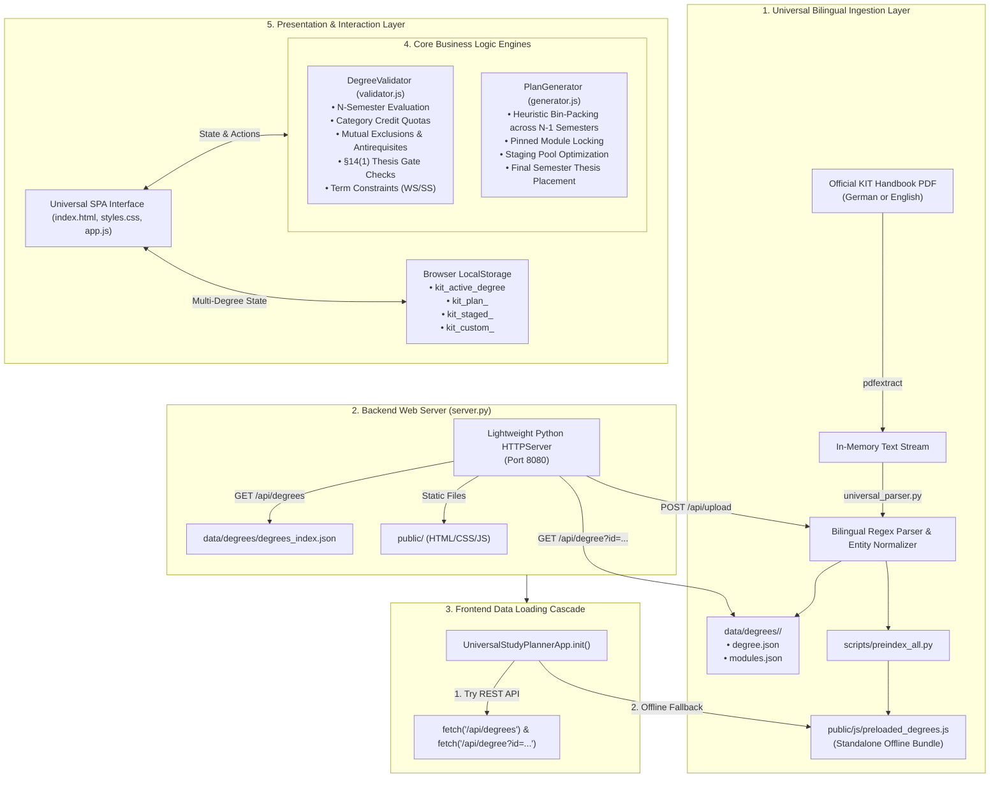

# Developer Documentation & Architecture Guide
## Universal KIT Master Degree Planner & Modulhandbuch Platform

This document provides a comprehensive reference for developers, maintainers, and contributors working on the **Universal KIT Master Degree Planner and Module Handbook Platform**. It covers the system architecture, universal bilingual data ingestion pipeline, dynamic multi-degree models, degree audit engines, and frontend state management.

---

## 1. System Overview & Philosophy

The platform is an interactive web-based study planning, conflict analysis, and degree audit application designed for Master of Science degrees at the **Karlsruhe Institute of Technology (KIT)**. It allows students to select from pre-indexed KIT Master's programs or upload **any official KIT Module Handbook PDF** to automatically generate an interactive planner board, catalog search, and rule verification system.

### Core Architectural Principles
1. **Zero External Dependencies**: The backend requires only the Python 3 standard library (`http.server`, `json`, `re`, `urllib`, `subprocess`). No `pip install`, no node/npm build step, and no external package managers are needed to run or deploy the system.
2. **Dual-Mode Execution (Server & Standalone Offline)**: The frontend can run either via the local Python HTTP server (`server.py`) using REST APIs or completely standalone via `file:///` in a web browser using the embedded multi-degree bundle (`public/js/preloaded_degrees.js`).
3. **Universal Document Schema Ingestion**: KIT faculties generate Module Handbooks through a shared campus management system. A single unified regex pipeline extracts 100% of accredited modules, prerequisites, exclusion rules, and recurrence terms across all faculties in both German and English.
4. **Dynamic Semester Pacing & Pacing Flexibility**: Students can dynamically add or remove semesters (`+ Add Semester` / `- Remove Semester`) for internships, working student positions, or study abroad. Workload benchmarks and term alternating frequencies (`WS` $\leftrightarrow$ `SS`) adjust automatically.
5. **Instant Interactive Verification**: Degree audit algorithms and constraint solvers run in real-time in the browser upon every drag, drop, pin, or configuration change.

---

## 2. High-Level Architecture



---

## 3. Directory & File Structure

```
Modulhandbuch-tool/
├── server.py                        # Zero-dependency Python HTTP & REST API server
├── pdfextract                       # Native macOS PDFKit extraction binary
├── modulhandbücher/                 # Canonical storage of official KIT handbook PDFs
├── data/
│   └── degrees/                     # Extracted degree profiles
│       ├── etit-msc-2025/           # { degree.json, modules.json }
│       ├── cs-msc-2025/             # { degree.json, modules.json }
│       ├── physics-msc-2023/        # { degree.json, modules.json }
│       ├── biw-msc-2025/            # { degree.json, modules.json }
│       ├── math-msc-2016/           # { degree.json, modules.json }
│       ├── arch-msc-2021/           # { degree.json, modules.json }
│       └── degrees_index.json       # Manifest of installed degrees
├── scripts/
│   ├── universal_parser.py          # Bilingual extraction engine for KIT Master handbooks
│   ├── preindex_all.py              # CLI utility to pre-index all handbooks
│   ├── validate_plan.py             # Headless CLI plan verification tool
│   ├── test_category_attribution.js # Automated verification for category attribution
│   └── test_staged_autoplan.js      # Automated test suite for staged autoplan solver
├── DOCUMENTATION.md                 # Developer & architecture guide
├── README.md                        # Quickstart guide & repository overview
└── public/                          # Client web assets
    ├── index.html                   # Main application layout & modal dialogs
    ├── css/
    │   └── styles.css               # KIT design system tokens & component styles
    └── js/
        ├── preloaded_degrees.js     # Standalone offline bundle of precompiled degrees
        ├── validator.js             # Universal degree rules & conflict engine
        ├── generator.js             # Universal heuristic auto-planner
        └── app.js                   # Universal application controller & UI state manager
```

---

## 4. Data Models & Schemas

The application revolves around four primary entities: `Degree`, `Module`, `DegreeCategory`, and `StudyPlan`.

### 4.1 Degree Schema (`degree.json`)
```typescript
interface Degree {
  id: string;                        // e.g., "etit-msc-2025", "cs-msc-2025"
  title: string;                     // e.g., "M.Sc. Electrical Engineering and Information Technology"
  spo: number;                       // e.g., 2025
  term: string;                      // e.g., "Summer semester 2026"
  faculty: string;                   // e.g., "KIT Department of Electrical Engineering..."
  totalCredits: number;              // Fixed at 120 CP for Master's programs
  semestersCount: number;            // Default 4 semesters (dynamically expandable)
  thesisCredits: number;             // Fixed at 30 CP
  thesisPrerequisiteCredits: number; // §14(1) gate: 75 CP
  moduleCount: number;               // Total modules in catalog
  specializations: Specialization[]; // Tracks / Vertiefungsrichtungen (if applicable)
  categories: DegreeCategory[];      // Subject areas & CP target quotas
  rules: DegreeRules;                // Validation rules object
}

interface Specialization {
  id: string;                        // e.g., "ARSE", "EPSE"
  name: string;                      // Full English or German name
  modules?: string[];                // Eligible module IDs
}

interface DegreeCategory {
  id: string;                        // "specialization", "core", "electives", "uq", "thesis"
  name: string;                      // Display name, e.g., "Specialization", "Electives"
  targetCredits: number;             // e.g., 54, 30, 6, 30
  color: string;                     // CSS variable token
}
```

### 4.2 Module Schema (`modules.json`)
```typescript
interface Module {
  id: string;                        // e.g., "M-ETIT-103802"
  title: string;                     // e.g., "Adaptive Optics"
  credits: number;                   // Credit points (ECTS)
  term: "WS" | "SS" | "WS+SS";       // Normalized recurrence
  termString: string;                // Raw description, e.g., "Each winter term"
  duration: string;                  // e.g., "1 term"
  language: string;                  // "English", "German", or "German/English"
  grading: "graded" | "pass/fail";   // Grading modality
  coordinators: string[];            // Lecturers and coordinators
  organisation: string;              // Institute or faculty
  partOf: string[];                  // Categories & curriculum blocks from handbook
  categories: string[];              // Normalized category assignments
  applicableSpecializations: string[];// Track codes (e.g. ["ARSE", "ICT"])
  isLab: boolean;                    // True if laboratory, practical, or workshop
  isThesis: boolean;                 // True if Master's Thesis
  isCustom?: boolean;                // True if user-created course
  examType: string;                  // Assessment modality
  prerequisites: string;             // Text prerequisites
  modeledPrerequisites: string;      // Formal KIT prerequisites
  exclusions: string[];              // Mutually exclusive module IDs
  requires: string[];                // Hard prerequisite module IDs
  competenceGoal: string;            // Learning outcomes
  content: string;                   // Syllabus
  workload: string;                  // Workload hours breakdown
  recommendations: string;           // Recommended prior knowledge
  literature: string;                // Bibliography
}
```

### 4.3 Study Plan Schema (LocalStorage: `kit_plan_<degreeId>`)
```typescript
interface StudyPlan {
  degree: string;                    // Degree ID
  specialization: string | null;     // Selected track
  startTerm: "WS" | "SS";            // Starting semester term
  semestersCount: number;            // Current planned semesters (4, 5, 6, 7, 8)
  name?: string;                     // Custom plan name
  semesters: Record<number, ScheduledItem[]>; // 1: [...], 2: [...], ..., N: [...]
}

interface ScheduledItem {
  id: string;                        // Module ID (e.g. "M-ETIT-105123" or "CUSTOM-123456")
  category: string;                  // Designated category label
  isPinned?: boolean;                // True if locked to this semester
}
```

### 4.4 Custom Module Schema (LocalStorage: `kit_custom_<degreeId>`)
```typescript
interface CustomModule extends Module {
  id: string;                        // Format: "CUSTOM-XXXXXX"
  title: string;                     // User-defined course or external credit name
  credits: number;                   // 1 to 30 ECTS CP
  term: "WS" | "SS" | "WS+SS";       // Offered semester recurrence
  language: "German" | "English" | "German/English";
  categories: string[];              // e.g. ["Interdisciplinary (ÜQ)"], ["Electives"], or ["Specialization"]
  applicableSpecializations: string[];
  isCustom: true;                    // Flag indicating user-managed module
  coordinators: string[];            // Default: ["Self-Enrolled / HoC / SPZ"]
  prerequisites: string;             // Default: "None"
}
```

### 4.5 Client LocalStorage State Keys
| Key | Type | Description |
|---|---|---|
| `kit_active_degree` | `string` | ID of the currently active degree program |
| `kit_plan_<degreeId>` | `StudyPlan` | Saved semester distribution, track, and pinned states |
| `kit_staged_<degreeId>` | `string[]` | Array of module IDs currently staged in the candidate backlog |
| `kit_custom_<degreeId>` | `CustomModule[]` | Array of user-created custom courses and external credits |
| `kit_staging_collapsed` | `"true" \| "false"` | Persisted UI collapse state for the Staging Area drawer |
| `kit_ribbon_collapsed` | `"true" \| "false"` | Persisted UI collapse state for the top header ribbon |

---

## 5. Universal Ingestion Pipeline (`scripts/universal_parser.py`)

The universal parser processes official KIT Module Handbook PDFs into standardized JSON datasets:

1. **Text Extraction**: Runs native `./pdfextract` to parse PDF layout into an in-memory text stream.
2. **Metadata Discovery**:
   - Cover text analysis identifies the degree title, SPO year, and faculty.
   - Determines standard 120 CP total and 4-semester duration.
3. **Module Extraction**:
   - Finds the start of the *Teilleistungen* / *Module components* section to isolate the module catalog.
   - Matches module entries across both German and English handbooks using the universal regex:
     ```regex
     (?:^|\n)\s*(?:M\s+)?(?:\d+\.\d+|\d+)\s+(?:Modul|Module):\s*(.*?)\s*\[\s*(M-[\sA-Z0-9\-]+?)\s*\]
     ```
   - Bilingual field extractors map `Credits` / `Leistungspunkte`, `Recurrence` / `Turnus`, `Language` / `Sprache`, `Organisation` / `Einrichtung`, and `Part of:` / `Bestandteil von:`.
4. **Antirequisite Mining**:
   - Scans prerequisites text for German and English exclusion phrases:
     - *"must not have been started"*, *"not allowed to take"*, *"only one out of"*
     - *"darf nicht begonnen worden sein"*, *"muss nicht begonnen haben"*, *"nur eines von"*
   - Automatically registers mutual exclusion pairs between modules.
5. **Specialization & Category Tagging**:
   - Parses the `Part of:` / `Bestandteil von:` field for track designations (e.g. *Vertiefung*, *Area of Specialization*, *Major*).
   - Associates modules with their respective tracks and degree categories.

---

## 6. Universal Degree Rules & Validation Engine (`public/js/validator.js`)

The validator audits any study plan across $1 \dots N$ semesters in real time:

| # | Rule Check | Type | Description |
|---|---|---|---|
| 1 | **Duplicate Enrollment** | Error | No course may be enrolled more than once across any semester. |
| 2 | **Mutual Exclusions** | Error | Enforces antirequisite pairs mined from course prerequisites and degree rules. |
| 3 | **Term Availability** | Warning | Compares course frequency (`WS` vs. `SS`) against the calculated term for Semester $k$. |
| 4 | **Category Quotas & Attribution** | Warning/OK | Audits planned credits against category targets (Specialization, Electives, ÜQ, Thesis). Credits are assigned strictly without fractional overflow leaks. |
| 5 | **Master's Thesis §14(1) Gate** | Error | Checks which semester holds the Master's Thesis ($S_{thesis}$) and verifies that $\ge 75\text{ CP}$ has been accumulated across all prior semesters $1 \dots (S_{thesis} - 1)$. |
| 6 | **Workload Balance** | Warning | Advisories for semesters exceeding 35 CP or deviating significantly from target pace. |

### 6.1 Multi-Category Attribution & Leak Prevention
Certain courses qualify for multiple categories (e.g., both Focus Area and Electives). `validator.js` evaluates the explicit user selection stored in `ScheduledItem.category` via `normalizeCategoryId()`. Credits are attributed strictly to the designated category without splitting or leaking overflow points into general electives.

### 6.2 Custom Module Category Integration
When auditing user-created custom courses (`mod.isCustom === true`), `inferCategory()` returns the module's declared category (e.g. *Interdisciplinary (ÜQ)*, *Electives*, or *Specialization*). Similarly, `getAvailableCategoryIds()` permits the course to count towards its assigned category or general electives.

---

## 7. Universal Auto-Planner & Constraint Solver (`public/js/generator.js`)

The auto-planner uses heuristic constraint satisfaction:
1. **Pinned Preservation**: Locks all user-pinned modules to their exact semesters.
2. **Master's Thesis Placement**: Schedules the 30 CP thesis into the final semester ($N$).
3. **Staged Pool Distribution**: Distributes courses curated in the Staging Area across Semesters $1 \dots (N - 1)$, using `inferCategory()` to assign canonical category labels while respecting term frequency (`WS` vs. `SS`) and ~30 CP semester limits.
4. **Optional Catalog Fill**: When enabled, draws from available specialization and elective modules to complete 120 CP.

---

## 8. Frontend Architecture & State Management (`public/js/app.js`)

The client application manages all multi-degree interactions, persistent state, and interactive controls:

### 8.1 Custom Modules Management (CRUD Lifecycle)
Users can add, edit, and delete custom courses or external credits (e.g. *Sprachenzentrum* language courses, HoC/ZAK workshops, transfer credits):
- **Creation (`openAddCustomModal`)**: Opens `#customModal` in creation mode with dynamic degree categories, pre-selecting *Interdisciplinary (ÜQ)*.
- **In-Place Editing (`openEditCustomModal`)**:
  - Populates `#customModal` with the module's active title, credits, term, language, and category.
  - Automatically synchronizes edits across `this.customModules`, `this.modulesMap`, `this.modulesList`, and any active semester slots in `this.plan.semesters`.
  - Re-triggers degree validation and refreshes catalog, staging, and planner views.
- **Safe Deletion (`deleteCustomModule`)**:
  - Prompts with a native confirmation dialog to prevent accidental data loss.
  - Cascades removal across `customModules`, `modulesList`, `modulesMap`, `stagedModules`, and all semester plan slots.
  - Closes the inspection modal if displaying the deleted module and automatically resets the active category filter if no custom courses remain.
- **UI Quick-Action Triggers**:
  - **Catalog Cards**: `✏️ Edit` and `🗑️` Delete buttons in the card footer.
  - **Staged Cards**: `✏️` Edit icon button and `✕` Unstage button.
  - **Semester Cards**: `✏️` Edit icon button in the action bar.
  - **Module Details Modal**: `✏️ Edit Course` and `🗑️ Delete Course` buttons in the footer, plus an identifying custom course badge in the header.
- **Dynamic Catalog Filter Pill**: When custom modules exist, a dynamic `✏️ Custom (<count>)` pill appears in `#categoryPills` to filter the catalog down to user-created courses.

### 8.2 Collapsible Staging Area
The staging tray provides an uncommitted backlog for prospective courses:
- **Collapsible Toggle**: Toggleable via `#btnToggleStaging` or chevron controls. State is persisted in `localStorage` under `kit_staging_collapsed`.
- **Live CP & Course Counter**: The badge `#stagedStatsBadge` displays real-time course and credit totals with a `.badge-pulse` animation on additions or removals.
- **Drag-and-Drop Staging**: Modules can be dragged directly into the staging tray or added via the `📦 Stage` button.

### 8.3 Multi-Category Attribution Switcher
For modules eligible for multiple curriculum areas (e.g. Focus Area vs. Electives):
- An interactive `.cat-pill-wrapper` dropdown pill is rendered on the semester card and in the inspection modal.
- Selecting an alternative category updates `ScheduledItem.category`, persists to `localStorage`, and instantly updates progress tallies with zero fractional leaks.

### 8.4 Collapsible Top Ribbon & Workspace Optimization
- The top header ribbon (Degree Selector, Specialization, Actions) can be toggled using `#btnToggleRibbon` or the keyboard shortcut **`Alt+H`**.
- State is preserved across reloads via `kit_ribbon_collapsed`.

### 8.5 Dynamic Semester Controls
- **`+ Add Semester`**: Expands the plan up to 8 semesters, alternating terms automatically (`WS` $\leftrightarrow$ `SS`) and updating pacing benchmarks.
- **`- Remove Semester`**: Safely trims trailing empty semesters, warning users if courses need to be moved to staging.

### 8.6 Module Catalog Sorting & Pagination
- **Credit Points & Alphabetical Sorting**: The `#filterSort` dropdown allows students to sort the course catalog by:
  - **`Credits (High → Low)`**: Sorts by ECTS credit weighting descending (with alphabetical secondary tie-break).
  - **`Credits (Low → High)`**: Sorts by ECTS credit weighting ascending.
  - **`Title (A → Z)`**: Alphabetical by course title.
  - **`Code (A → Z)`**: Alphabetical by module ID.
  - **`Sort: Default`**: Restores the natural handbook syllabus order.
- **State Persistence**: Selected sort order is preserved in `localStorage` under `kit_catalog_sort`.
- **Dynamic Catalog Status Bar**: Displays real-time matching counts (`#catalogCountText`) and active sort indicators (`#catalogSortIndicator`).
- **Responsive Pagination**: Smoothly renders an initial batch with an on-demand `Show more (+50 remaining)` button for extensive curricula with hundreds of modules.

---

## 9. Developer Operations Guide

### 9.1 Running Locally
```bash
python3 server.py
# Server runs at http://localhost:8080/
```

### 9.2 Uploading a New Handbook via UI
1. Start `server.py`.
2. Click **"Upload Handbook"** in the top navigation bar.
3. Drop in any official KIT Master Module Handbook PDF.
4. Review the extracted title, module count, and tracks in the preview card.
5. Click **"Activate & Start Planning"** to immediately switch to the new degree.

### 9.3 Batch Re-indexing Local Handbooks via CLI
To parse and index all PDFs in `modulhandbücher/`:
```bash
python3 scripts/preindex_all.py
```
This updates `data/degrees/` and regenerates `public/js/preloaded_degrees.js`.

### 9.4 Headless Plan Verification via CLI
```bash
python3 scripts/validate_plan.py etit-msc-2025
python3 scripts/validate_plan.py cs-msc-2025
```

### 9.5 Running Automated Verification Suites
```bash
node scripts/test_category_attribution.js # Category attribution & leak prevention audit
node scripts/test_staged_autoplan.js      # Staged pool distribution & solver tests
```
